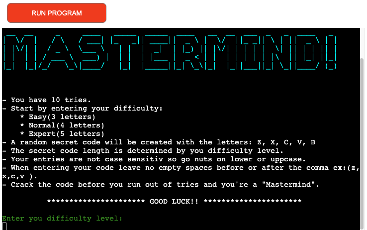
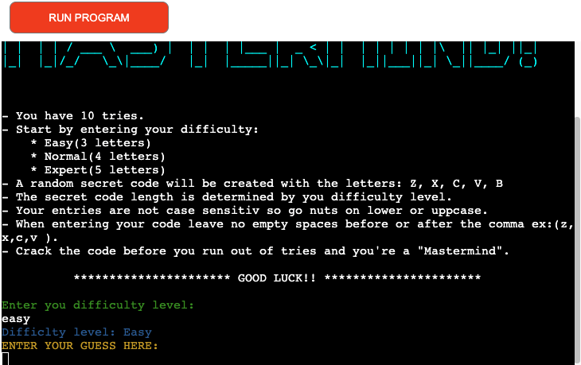
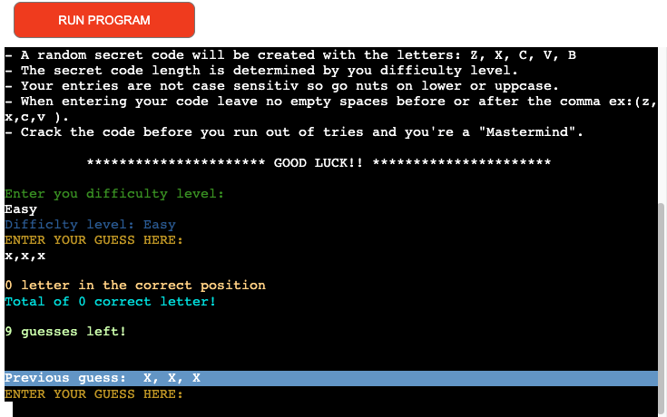
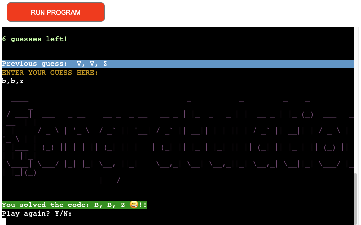
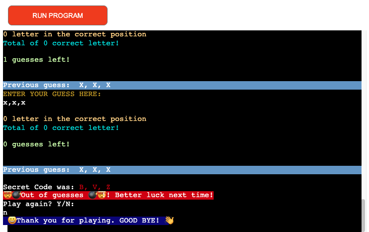

<div align="center"><h1>MASTERMIND!</h1></div>

## Description 

*Mastermind* is a Python terminal game that uses the command line to solve the secret code.

There are three levels of difficulty. Each level increases the length of the secret code by one letter. Starting with the easy level having only a 3 letter code to solve. Every player will have 10 tries to solve the code. See if you can solve the code before your tries run out.


## Table of Content 

1. [Description](#description)
2. [Table of Content](#table-of-content)
3. [How to play](#how-to-play)
4. [Features](#features)
5. [Data Model](#data-model)
6. [Libraries](#libraries)
7. [Testing](#testing)
8. [Bugs](#bugs)
9. [Deployment](#deployment)
10. [Credits and Acknowledgements](#credits-and-acknowledgements)

## How to play

## Features









## Data Model 

I use function base progamming as my model. The game creats a random secret code from a list of five letters: z,x,c,v, or b. Each code length is determinded by the player inputing their difficulty level throung the command line.

Each function calls on various methond to create the random code and print statement as the game runs.
The print method is mainly used to informs the player of their progress in solving the secret code.

## Libraries

## Testing
Testing of Mastermind was done manually by:
    - Ran code through a [PEP8](https://pep8ci.herokuapp.com/) linter with no major issues.  
    - Performed multiple run ups of the game entering various correct and incorrect inputs to check input validators.   
    - Played the game multiple times to ensure that the attemp count updated correctly. 

## Bugs
Bugs Solved:
- Issues with updating the total number of letters with players input list to account for letters within the sercet code not just in the players guess.  
Was solved by creating a dictionary to keep of track of the number of times each letter occurred in the secret code.

        ``` 
        remaining_letters = {
            letter: secret_code.count(letter) for letter in secret_code
        }

        ***
        if guess in secret_code and remaining_letters[guess] > 0:
                total_letters += 1
                remaining_letters[guess] -= 1
        ```
- No bugs on deployment were detected.
  
## Deployment 
- Deployment was performed using [HEROKU](heroku.com/apps).

## Credits and Acknowledgements
- [Geeks for Geeks:]( https://www.geeksforgeeks.org/) along side [ChatGBT](https://chat.openai.com/) to solve the issue the updating the total of correct letters with each players guess.  

